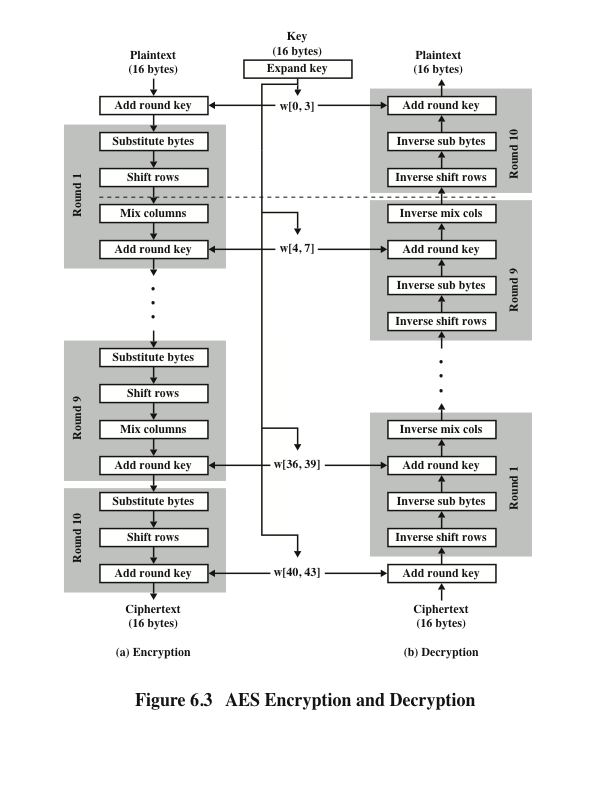
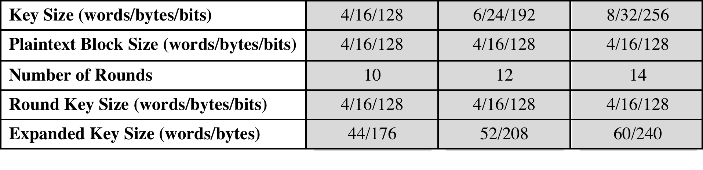

```python
from test_aes import *
```

# AES Cipher

The following Figure shows the AES cipher in more detail, indicating the sequence of transformations in each round and showing the corresponding decryption function. In this notebook, we are going to implement AES cipher which performs encryption and decryption.




Notice that

- The first $N - 1$ rounds consist of four distinct transformation functions: SubBytes, ShiftRows, MixColumns, and AddRoundKey. 
- The final round contains only three transformations, 


## Import AES Round API

**Exercise:** We have implement the AES round procedure in `AES_round_function` notebook for homework. Do the following procedure:
1. Backup your original `AES_round_function.ipynb`.
2. Remove `from test_AES import *` and all sanity checks and grade calculation cells from  `AES_round_function.ipynb` and save the notebook.
3. Download the `AES_round_function.ipynb` as `aes_round_api.py`
4. Import `aes_round_enc`, `aes_round_dec` and `add_round_key` from `aes_round_api`


```python
# Import aes_round_enc and aes_round_dec from aes_round_api
from aes_round_api import aes_round_enc,aes_round_dec,add_round_key
```

## Import Key Expansion API

**Exercise:** We have implement the AES key expansion in `aes_key_expansion` notebook for homework. Do the following procedure:
1. Backup your original `aes_key_expansion.ipynb`.
2. Remove `from test_aes_key_expansion import *` and all sanity checks and grade calculation cells from  `aes_key_expansion.ipynb` and save the notebook.
3. Download the `aes_key_expansion.ipynb` as `aes_key_api.py`
4. Import `expand_key_128`, `expand_key_192` and `expand_key_256` from `aes_key_api`


```python
# Import expand_key_128, expand_key_192 and expand_key_256 from aes_key_api
from aes_key_api import expand_key_128, expand_key_192, expand_key_256
```

## Implement AES Cipher

**Exercise:** Implement `aes_cipher(input_block, initial_key, mode)` to perform AES encryption and decryption for different key length where:

- `input_block` represent `Plaintext` when `mode` is encryption 'E' and `Ciphertext` when `mode` is decryption 'D'
- `initial_key` represent the key.

The cipher consists of $N$ rounds, where the number of rounds depends on the key length: 10 rounds for a 16-byte key, 12 rounds for a 24-byte key, and 14 rounds for a 32-byte key as listed below:



To implement `aes_cipher()`:

- Use `aes_round_enc` and `aes_round_dec` for encyption and decryption round operation.
- Use `expand_key_128`, `expand_key_192`, and `expand_key_256` to expand key for different key length.
- Notice that there is a initial single transformation (AddRoundKey) before the first round, which can be considered Round 0 (see figure 6.3). Use `add_round_key` for this step. 


```python
def aes_cipher(input_block, initial_key, mode):
    
    
    # verify mode should be either 'E' or 'D' using assert statement
    assert(mode=="D" or mode =="E"),"Invalid Mode!"
    
    # verify that key has a valid length (according to the table above) using assert statement and 
    # perform key expansion based on the initial_key 
    expanded_key = initial_key
    assert(len(initial_key)==16 or len(initial_key)==24 or len(initial_key)==32),"Invalid key!"
    if(len(initial_key)==16):
        expanded_key = expand_key_128(expanded_key)
    elif(len(initial_key)==24):
        expanded_key = expand_key_192(expanded_key)
    elif(len(initial_key)==32):
        expanded_key = expand_key_256(expanded_key)
        
    # verify that the inputblock has a valid length using assert statement and
    # perform aes encryption and decryption based on the mode ('E' or 'D')
    # Notice that there is a initial single transformation (AddRoundKey)
    # before the first round, which can be considered Round 0 
    
    assert(len(input_block)==16),"Invalid input"
    n = 0
    input_block = add_round_key(input_block,expanded_key)
    if mode=="E":
        if len(initial_key)==16:
            while n<10:
                input_block = aes_round_enc(input_block,expanded_key)
                n = n+1
        if len(initial_key)==24:
            while n<12:
                input_block = aes_round_enc(input_block,expanded_key)
                n = n+1
        if len(initial_key)==32:
            while n<14:
                input_block = aes_round_enc(input_block,expanded_key)
                n = n+1
                
        input_block = aes_round_enc(input_block,expanded_key,last_round=True)
                
    if mode=="D":
        if len(initial_key)==16:
            while n<10:
                input_block = aes_round_dec(input_block,expanded_key)
                n = n+1
        if len(initial_key)==24:
            while n<12:
                input_block = aes_round_dec(input_block,expanded_key)
                n = n+1
        if len(initial_key)==32:
            while n<14:
                input_block = aes_round_dec(input_block,expanded_key)
                n = n+1
        
        input_block = aes_round_dec(input_block,expanded_key,last_round=True)
        
    output_block = input_block
    return output_block
            
```
