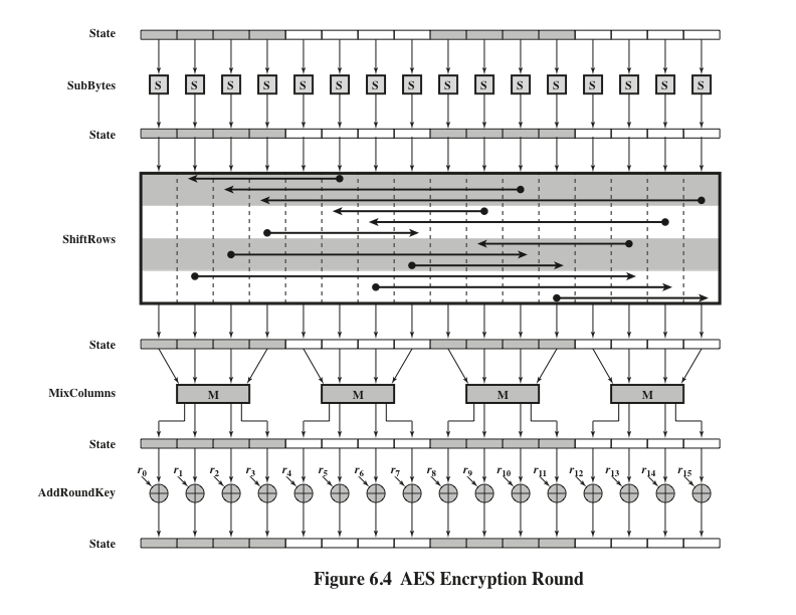
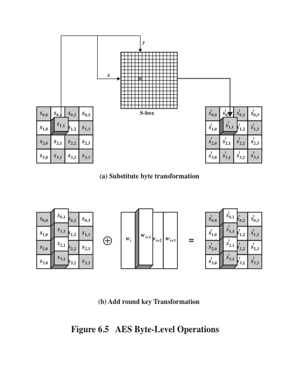
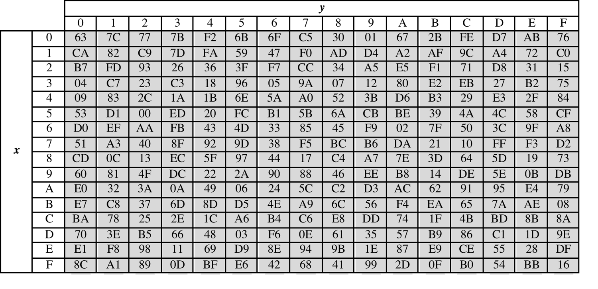
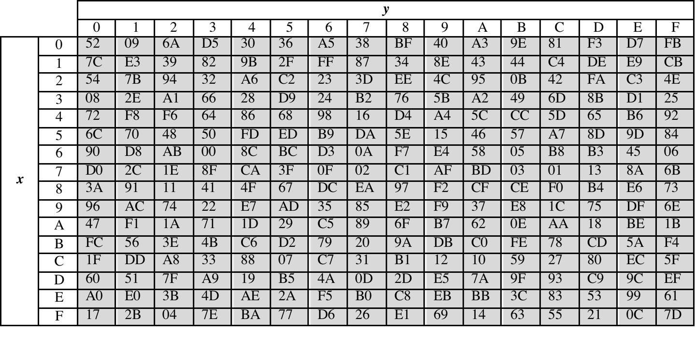
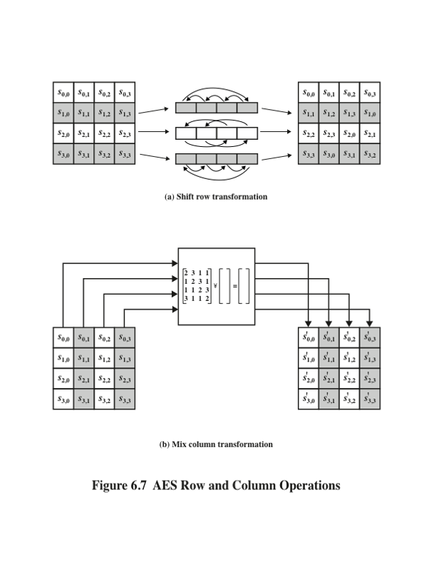
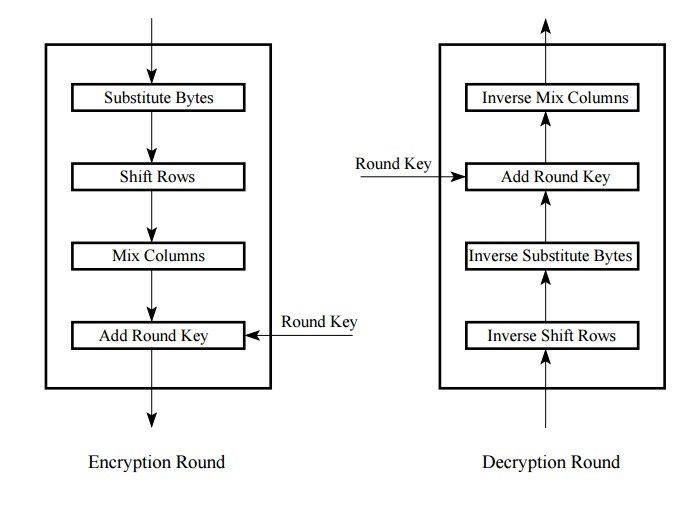

```python
from test_AES import *
from pyfinite import ffield, genericmatrix
```

## Operation of AES

AES is an iterative rather than Feistel cipher. It is based on **substitution–permutation network**. It comprises of a series of linked operations, some of which involve replacing inputs by specific outputs (substitutions) and others involve shuffling bits around (permutations).

Interestingly, AES performs all its computations on *bytes* rather than *bits*. Hence, AES treats the 128 bits of a plaintext block as 16 bytes. These 16 bytes are arranged in four columns and four rows for processing as a matrix

Unlike DES, the number of rounds in AES is variable and depends on the length of the key. AES uses 10 rounds for 128-bit keys, 12 rounds for 192-bit keys and 14 rounds for 256-bit keys. Each of these rounds uses a different 128-bit round key, which is calculated from the original AES key.


All operations in a round of AES are invertible:

- **AddRoundKey: **each byte of the round key is combined with the corresponding byte in the state using XOR
- **SubBytes:  **each byte in the state is replaced with a different byte according to the S-Box lookup table
- **ShiftRows: **each row in the state table is shifted by a varying number of bytes
- **MixColumns: **each column in the state table is multiplied with a fixed polynomial



<font color='blue'>
In this notebook, we are going to implement these operations and use them to implement the aes round function for encryption and decryption.
</font>

### Addroundkey

The 16 bytes of the matrix are now considered as 128 bits and are XORed to the 128 bits of the round key. If this is the last round then the output is the ciphertext. Otherwise, the resulting 128 bits are interpreted as 16 bytes and we begin another similar round- 

- Each byte of the round key is XORed with the corresponding byte in the state table
- Inverse operation is identical since XOR a second time returns the original values

**Exercise:** Implement `add_round_key(state, round_key)` 


```python
def add_round_key(input_state, round_key):
    # make a bytearray with size of input_state
    output_state = bytearray(input_state)
    
    # xor each byte with the round_key, perform xor
    for i in range(len(input_state)):
        output_state[i] = output_state[i]^round_key[i]
    
    return output_state
```


```python
print('Sanity Check (add_round_key): ', test_add_round_key(add_round_key))
```

    Sanity Check (add_round_key):  True
    

### Byte Substitution (SubBytes)

The 16 input bytes are substituted by looking up a fixed table (S-box) given in design. The result is in a matrix of four rows and four columns.

 - Each byte of the state table is substituted with the value in the S-Box whose index is the value of the state table byte
 - Provides non-linearity (algorithm not equal to the sum of its parts)
 - Inverse operation is performed using the inverted S-Box
 
 
 
 
#### S_BOX and S_BOX Inverse




```python
def get_sbox():
    
    Sbox = (0x63, 0x7C, 0x77, 0x7B, 0xF2, 0x6B, 0x6F, 0xC5, 0x30, 0x01, 0x67, 0x2B, 0xFE, 0xD7, 0xAB, 0x76,
            0xCA, 0x82, 0xC9, 0x7D, 0xFA, 0x59, 0x47, 0xF0, 0xAD, 0xD4, 0xA2, 0xAF, 0x9C, 0xA4, 0x72, 0xC0,
            0xB7, 0xFD, 0x93, 0x26, 0x36, 0x3F, 0xF7, 0xCC, 0x34, 0xA5, 0xE5, 0xF1, 0x71, 0xD8, 0x31, 0x15,
            0x04, 0xC7, 0x23, 0xC3, 0x18, 0x96, 0x05, 0x9A, 0x07, 0x12, 0x80, 0xE2, 0xEB, 0x27, 0xB2, 0x75,
            0x09, 0x83, 0x2C, 0x1A, 0x1B, 0x6E, 0x5A, 0xA0, 0x52, 0x3B, 0xD6, 0xB3, 0x29, 0xE3, 0x2F, 0x84,
            0x53, 0xD1, 0x00, 0xED, 0x20, 0xFC, 0xB1, 0x5B, 0x6A, 0xCB, 0xBE, 0x39, 0x4A, 0x4C, 0x58, 0xCF,
            0xD0, 0xEF, 0xAA, 0xFB, 0x43, 0x4D, 0x33, 0x85, 0x45, 0xF9, 0x02, 0x7F, 0x50, 0x3C, 0x9F, 0xA8,
            0x51, 0xA3, 0x40, 0x8F, 0x92, 0x9D, 0x38, 0xF5, 0xBC, 0xB6, 0xDA, 0x21, 0x10, 0xFF, 0xF3, 0xD2,
            0xCD, 0x0C, 0x13, 0xEC, 0x5F, 0x97, 0x44, 0x17, 0xC4, 0xA7, 0x7E, 0x3D, 0x64, 0x5D, 0x19, 0x73,
            0x60, 0x81, 0x4F, 0xDC, 0x22, 0x2A, 0x90, 0x88, 0x46, 0xEE, 0xB8, 0x14, 0xDE, 0x5E, 0x0B, 0xDB,
            0xE0, 0x32, 0x3A, 0x0A, 0x49, 0x06, 0x24, 0x5C, 0xC2, 0xD3, 0xAC, 0x62, 0x91, 0x95, 0xE4, 0x79,
            0xE7, 0xC8, 0x37, 0x6D, 0x8D, 0xD5, 0x4E, 0xA9, 0x6C, 0x56, 0xF4, 0xEA, 0x65, 0x7A, 0xAE, 0x08,
            0xBA, 0x78, 0x25, 0x2E, 0x1C, 0xA6, 0xB4, 0xC6, 0xE8, 0xDD, 0x74, 0x1F, 0x4B, 0xBD, 0x8B, 0x8A,
            0x70, 0x3E, 0xB5, 0x66, 0x48, 0x03, 0xF6, 0x0E, 0x61, 0x35, 0x57, 0xB9, 0x86, 0xC1, 0x1D, 0x9E,
            0xE1, 0xF8, 0x98, 0x11, 0x69, 0xD9, 0x8E, 0x94, 0x9B, 0x1E, 0x87, 0xE9, 0xCE, 0x55, 0x28, 0xDF,
            0x8C, 0xA1, 0x89, 0x0D, 0xBF, 0xE6, 0x42, 0x68, 0x41, 0x99, 0x2D, 0x0F, 0xB0, 0x54, 0xBB, 0x16)
    return Sbox
        
```

#### S_BOX Inverse



```python
def get_sbox_inverse():
    Sbox_inv = (
            0x52, 0x09, 0x6A, 0xD5, 0x30, 0x36, 0xA5, 0x38, 0xBF, 0x40, 0xA3, 0x9E, 0x81, 0xF3, 0xD7, 0xFB,
            0x7C, 0xE3, 0x39, 0x82, 0x9B, 0x2F, 0xFF, 0x87, 0x34, 0x8E, 0x43, 0x44, 0xC4, 0xDE, 0xE9, 0xCB,
            0x54, 0x7B, 0x94, 0x32, 0xA6, 0xC2, 0x23, 0x3D, 0xEE, 0x4C, 0x95, 0x0B, 0x42, 0xFA, 0xC3, 0x4E,
            0x08, 0x2E, 0xA1, 0x66, 0x28, 0xD9, 0x24, 0xB2, 0x76, 0x5B, 0xA2, 0x49, 0x6D, 0x8B, 0xD1, 0x25,
            0x72, 0xF8, 0xF6, 0x64, 0x86, 0x68, 0x98, 0x16, 0xD4, 0xA4, 0x5C, 0xCC, 0x5D, 0x65, 0xB6, 0x92,
            0x6C, 0x70, 0x48, 0x50, 0xFD, 0xED, 0xB9, 0xDA, 0x5E, 0x15, 0x46, 0x57, 0xA7, 0x8D, 0x9D, 0x84,
            0x90, 0xD8, 0xAB, 0x00, 0x8C, 0xBC, 0xD3, 0x0A, 0xF7, 0xE4, 0x58, 0x05, 0xB8, 0xB3, 0x45, 0x06,
            0xD0, 0x2C, 0x1E, 0x8F, 0xCA, 0x3F, 0x0F, 0x02, 0xC1, 0xAF, 0xBD, 0x03, 0x01, 0x13, 0x8A, 0x6B,
            0x3A, 0x91, 0x11, 0x41, 0x4F, 0x67, 0xDC, 0xEA, 0x97, 0xF2, 0xCF, 0xCE, 0xF0, 0xB4, 0xE6, 0x73,
            0x96, 0xAC, 0x74, 0x22, 0xE7, 0xAD, 0x35, 0x85, 0xE2, 0xF9, 0x37, 0xE8, 0x1C, 0x75, 0xDF, 0x6E,
            0x47, 0xF1, 0x1A, 0x71, 0x1D, 0x29, 0xC5, 0x89, 0x6F, 0xB7, 0x62, 0x0E, 0xAA, 0x18, 0xBE, 0x1B,
            0xFC, 0x56, 0x3E, 0x4B, 0xC6, 0xD2, 0x79, 0x20, 0x9A, 0xDB, 0xC0, 0xFE, 0x78, 0xCD, 0x5A, 0xF4,
            0x1F, 0xDD, 0xA8, 0x33, 0x88, 0x07, 0xC7, 0x31, 0xB1, 0x12, 0x10, 0x59, 0x27, 0x80, 0xEC, 0x5F,
            0x60, 0x51, 0x7F, 0xA9, 0x19, 0xB5, 0x4A, 0x0D, 0x2D, 0xE5, 0x7A, 0x9F, 0x93, 0xC9, 0x9C, 0xEF,
            0xA0, 0xE0, 0x3B, 0x4D, 0xAE, 0x2A, 0xF5, 0xB0, 0xC8, 0xEB, 0xBB, 0x3C, 0x83, 0x53, 0x99, 0x61,
            0x17, 0x2B, 0x04, 0x7E, 0xBA, 0x77, 0xD6, 0x26, 0xE1, 0x69, 0x14, 0x63, 0x55, 0x21, 0x0C, 0x7D
    )
    return Sbox_inv
```

**Exercise:** Implement byte substitution `sub_bytes()`.


```python
def sub_bytes(input_state, mode):
    # make output_state with the same size as input_state
    output_state = bytearray(len(input_state))
    
    # get the sbox or sbox_inv according to the mode
    # encryption mode
    if mode == 'E': 
        sbox = get_sbox()
    
    # decryption mode
    elif mode == 'D':
        sbox = get_sbox_inverse()
    else:
        raise('Invalid mode of operation')
    
    
    # perform byte substitution 
    for i in range(len(input_state)):
        output_state[i] = sbox[input_state[i]] 
    
    return output_state
```


```python
print('Sanity Check (sub_bytes): ', test_sub_bytes(sub_bytes))
```

    Sanity Check (sub_bytes):  True
    


**Exercise:** Implement a utility function `rotate(word, n)` that returns a copy of the word:
        - circular left shifted n bytes (chars) positive values for n 
        - circular right shifted n bytes (chars) positive values for n


```python
def rotate(word, n):
    return word[n:]+word[:n]
```


```python
print('Sanity Check (rotate): ', test_rotate(rotate))
```

    Sanity Check (rotate):  True
    

## Shiftrows

The objective is to shift rows of the matrix which represent the *state*. Any entries that fall off are re-inserted on the right side of row (circular shift). Shift is carried out as follows:

   - First row is not shifted.

   - Second row is shifted one (byte) position to the left.

   - Third row is shifted two positions to the left.

   - Fourth row is shifted three positions to the left.
   
In summary:

   - *Encryption mode*: Each row in the state table is shifted left by the number of bytes represented by the row number
   - *Decryption mode*: Inverse operation simply shifts each row to the right by the number of bytes as the row number

The result is a new matrix consisting of the same 16 bytes but shifted with respect to each other.


**Exercise:** Implement `shift_rows(state)`. Hint: use the `rotate(word, n)` function to implement the shifts


```python
def shift_rows(input_state, mode):
    
    # make a output_state bytearray with the same length as the input
    output_state = bytearray(len(input_state))
    
    # depending on the mode of operation performs the shit_rows
    if mode == 'E':
        shift = 1
    elif mode == 'D':
        shift = -1
    else:
        raise ValueError('invalid mode of operation, mode = {0}'.format(mode))
        
    # iterate over each "virtual" row in the state table
    for i in range(0,len(input_state),4):
        output_state[i:i+4] = rotate(input_state[i:i+4],shift*(4))
    
        
    return output_state


```


```python
print('Sanity Check(shift_rows): ', test_shift_rows(shift_rows))
```

    Sanity Check(shift_rows):  True
    

## MixColumns

Each column of four bytes is now transformed using a special mathematical function. This function takes as input the four bytes of one column and outputs four completely new bytes, which replace the original column. The result is another new matrix consisting of 16 new bytes. *It should be noted that this step is not performed in the last round.*




MixColumns is performed by multiplying each column (within the Galois finite field) by the following matrix:


\begin{bmatrix}
2 & 3 & 1 & 1 \\
1 & 2 & 3 & 1 \\
1 & 1 & 2 & 3 \\
3 & 1 & 1 & 2
\end{bmatrix}


The inverse operation is performed by multiplying each column by the following inverse matrix:


\begin{bmatrix}
14 & 11 & 13 & 9 \\
9 & 14 & 11 & 13 \\
13 & 9 & 14 & 11 \\
11 & 13 & 9 & 14
\end{bmatrix}

We use Galois multiplication to multiple perform mix column.

**Exercise:** Implement `reshape_as_matrix()` that gets a state as an input argument and return a it as a form of a matrix in the GF($2^8$).


```python
def reshape_as_matrix(input_state):
    # define GF(2^8) (i.e., GF(256)) field
    F = ffield.FField(8)
    
    # define a matrix in GF(256)
    output_matrix = genericmatrix.GenericMatrix(size=(4,4),add=F.Add, sub=F.Subtract, mul=F.Multiply, div=F.Divide)
    
    # add the corresponding elements from the input_state to the matrix
    for i in range(4):
        output_matrix.SetRow(i,input_state[i*4:(i*4)+4])
    
    return output_matrix
    
```

**Exercise:** Implement `reshape_as_state()` that gets a state_matrix in the GF($2^8$) as an input argument and return a it as a form of bytearray list.


```python
def reshape_as_state(input_matrix):
    # get the size of the input matrix
    (rows, cols) = input_matrix.Size()
    
    # generate a bytearray list according to the size of the matrix
    output_state = bytearray(rows*cols)
    
    # populate the output_state using the input_matrix (row-wise)
    for i in range(rows):
        for j in range(cols):
            output_state[i*4 + j] = input_matrix[(i,j)]
            
    return output_state
```


```python
print('Sanity Check (reshape): ', test_reshape(reshape_as_matrix, reshape_as_state))
```

    Sanity Check (reshape):  True
    

**Exercise:**  Implement `mix_column()` that multiples each state column of the state_matrix with the  mix column matrix based on the encryption and decryption modes. 


```python
def mix_column(input_state, mode):
     
    
    # define GF(2^8) (i.e., GF(256)) field
    F = ffield.FField(8)
    
    
    # depending on the mode of operation get the right mix_column matrix
    if mode == 'E':
        column_matrix = genericmatrix.GenericMatrix(size=(4,4), add=F.Add, sub=F.Subtract, mul=F.Multiply, div=F.Divide)
        row = [2,3,1,1]
        for i in range(4):
            column_matrix.SetRow(i, row[:4])
            row = rotate(row, -1)
            
    elif mode == 'D':
        column_matrix = genericmatrix.GenericMatrix(size=(4,4), add=F.Add, sub=F.Subtract, mul=F.Multiply, div=F.Divide)
        row = [14,11,13,9]
        for i in range(4):
            column_matrix.SetRow(i, row[:4])
            row = rotate(row, -1)     
    else:
        raise ValueError('invalid mode of operation, mode = {0}'.format(mode))
        
    
    # convert input_state to input_matrix
    input_matrix = reshape_as_matrix(input_state)
    
    # perform matrix multiplication using * operator
    output_matrix =  input_matrix*column_matrix
    
    # convert output_matrix to output_state
    output_state = reshape_as_state(output_matrix)
    
    return output_state
```


```python
print('Sanity Check (mix_column): ', test_mix_column(mix_column))
```

    Sanity Check (mix_column):  True
    

## AES Round Function

At this point, we have all the necessary function to implement AES round encryption and decryption round functions. We implemented these functions to work on the encryption and decryption operation modes. 





**Exercise:** Implement `aes_round_enc()` to perform AES encryption round function.


```python
def aes_round_enc(input_state, round_key, last_round=False):
    
    # perform substitute byte
    output_state = sub_bytes(input_state,'E')
    
    # perform Shift row
    output_state = shift_rows(output_state,'E')
    
    # perform mix columns
    # Note: last round of encryption does not have the mix_column operation
    if not last_round:
        output_state = mix_column(output_state,'E')
    
    # perform Add round key
    output_state = add_round_key(output_state, round_key)
    
    return output_state
```

**Exercise:** Implement aes_round_dec() to perform AES decryption round function.


```python
def aes_round_dec(input_state, round_key, last_round=False):
    
    # perform inverse shift rows
    output_state =  sub_bytes(input_state, 'D')
    
    # perform inverse substitute byte
    output_state = shift_rows(output_state, 'D')
    
    # perform Add round key
    output_state = add_round_key(output_state,round_key)
    
    # perform inverse mix columns
    # Note: last round of decryption does not have the inverse mix_column operation
    if not last_round:
        output_state = mix_column(output_state,'D')
    
    return output_state
    
```


```python
print('Sanity Check (aes_round): ', test_aes_round(add_round_key, aes_round_enc, aes_round_dec))
```

    Sanity Check (aes_round):  True
    
